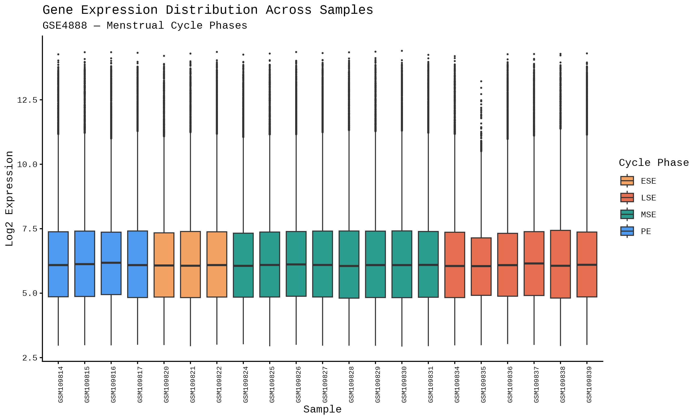
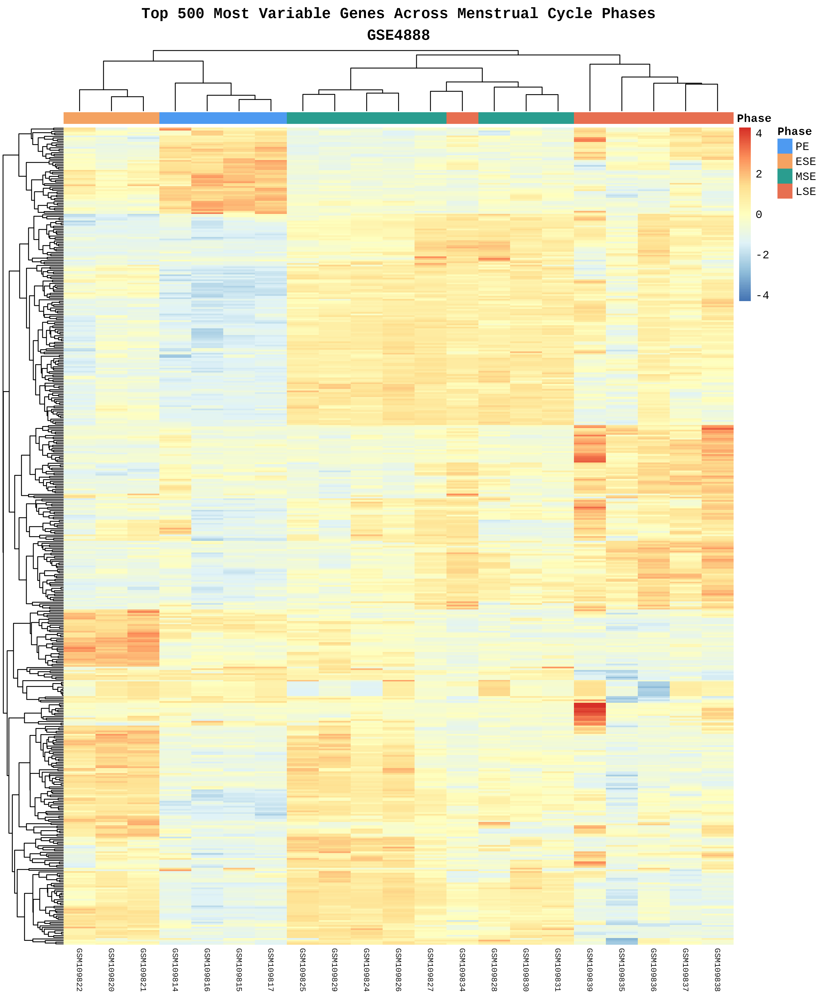
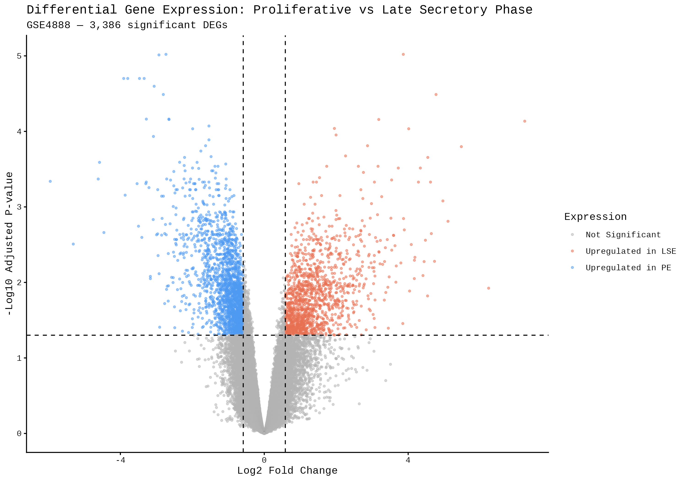
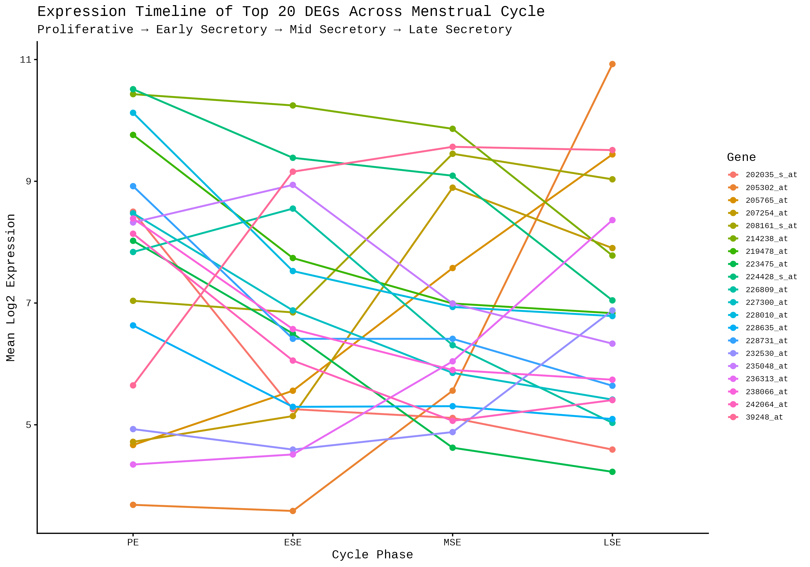
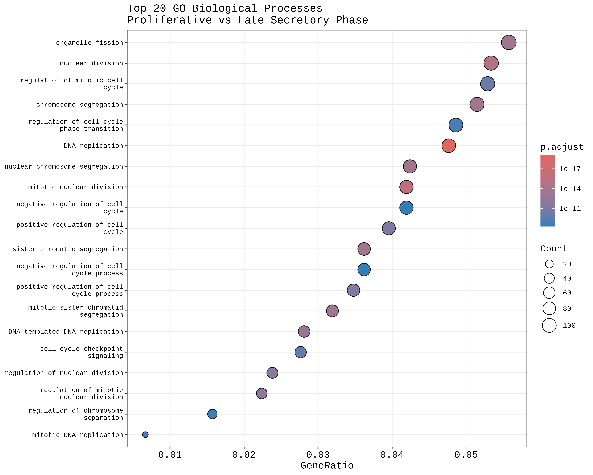
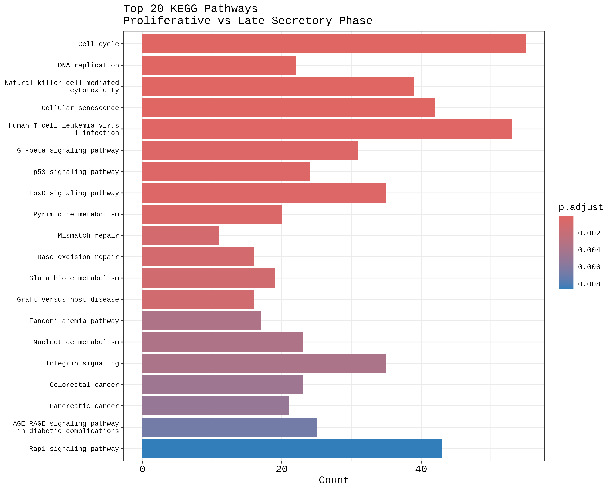
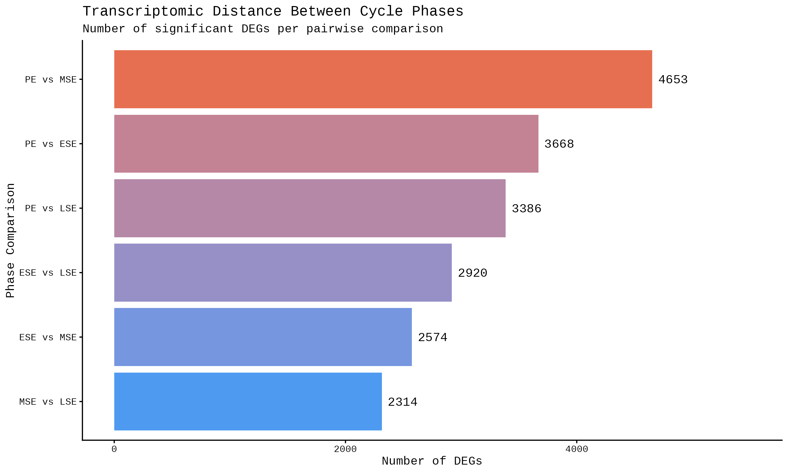
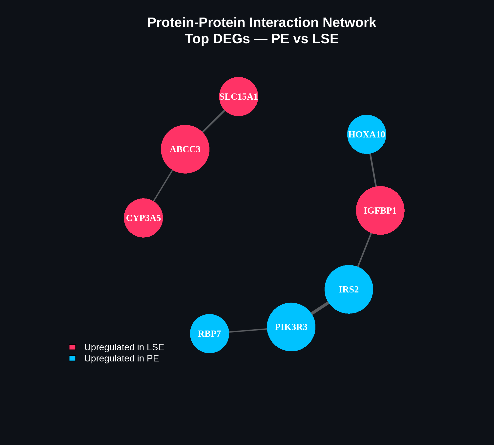

# Menstrual Cycle Transcriptomics Pipeline

### Computational Biology Internship Project | NexoraGroup | June 2026

**Author:** Shruti Banerjee  
**Tools:** R · tidyverse · GEOquery · limma · pheatmap · ggplot2  
**Data Source:** NCBI GEO — GSE4888

---

## Overview

In April 2026, Riishede et al. (*Nature Medicine*) mapped nearly 3,000 proteins across the menstrual cycle and found that **198 proteins fluctuate in synchronized patterns throughout the month** — touching immune function, metabolism, cardiovascular regulation, and neurological signalling.

Their finding raised two immediate questions:

> **What is happening at the gene expression level that drives these protein fluctuations?**
> **And why hasn't anyone built a clean, reproducible pipeline to investigate it?**

This project does both.

It is simultaneously a **transcriptomic analysis** of gene expression across menstrual cycle phases and a **modular, reusable R pipeline** that can be pointed at any GEO dataset by changing a single line.

Proteins tell us *what* changed. Genes tell us *why.*

---

## Background & Clinical Relevance

The menstrual cycle is not a reproductive side event — it is a **whole-body biological rhythm.** Yet most clinical drug dosing treats the female body as biologically static throughout the month.

If 198 proteins fluctuate rhythmically — including immune regulators, metabolic enzymes, and vascular signalling molecules — then a woman's response to medication may differ between week 1 and week 3. This has implications for:

- Antidepressants and ADHD medications
- Pain management and anaesthesia
- Oncology drugs and immunotherapies
- Cardiovascular treatments and vaccines

This project contributes toward **sex-aware, phase-aware precision medicine** — and toward making that research accessible and reproducible.

---

## Dataset

| Parameter | Detail |
|---|---|
| **GEO Accession** | GSE4888 |
| **Reference** | Talbi S et al. *Endocrinology* 2006 Mar;147(3):1097-121 |
| **Organism** | *Homo sapiens* |
| **Tissue** | Endometrium |
| **Platform** | GPL570 — Affymetrix Human Genome U133 Plus 2.0 |
| **Total Samples** | 27 (21 used after quality filtering) |
| **Cycle Phases** | Proliferative (PE) · Early Secretory (ESE) · Mid Secretory (MSE) · Late Secretory (LSE) |
| **Access** | Programmatic via GEOquery — no manual download required |

---

## Pipeline Architecture

```
config.R  ←  Change dataset, phases, or thresholds here
    ↓
01_data_import.R      — Pull any GEO dataset programmatically
    ↓
02_preprocess.R       — Clean metadata, remove ambiguous samples, log2 transform
    ↓
03_eda.R              — QC boxplot, top variable gene selection
    ↓
04_visualize.R        — Heatmap, volcano plot, expression timeline
    ↓
05_pathway_enrichment.R — GO & KEGG enrichment analysis
    ↓
06_ppi_network.R      — STRING protein interaction network
    ↓
figures/              — All plots saved automatically
```

> **Engineer note:** The entire pipeline is driven by `config.R`. Swap the GEO accession number and re-run — the pipeline adapts. No hardcoded values in any analysis script.

---

## Tools & Technologies

**Data Access & Wrangling**


**Analysis**


**Visualisation**


**Environment**


**Database**


---

## Results

### Sample Distribution After Quality Filtering

| Cycle Phase | Samples |
|---|---|
| Proliferative (PE) | 4 |
| Early Secretory (ESE) | 3 |
| Mid Secretory (MSE) | 8 |
| Late Secretory (LSE) | 6 |
| **Total** | **21** |

*6 samples with ambiguous histology readings were removed*

### Differentially Expressed Genes — PE vs LSE

| Metric | Value |
|---|---|
| Total genes tested | 54,675 |
| Significant DEGs (adj.p < 0.05, \|FC\| > 1.5) | **3,386** |
| Upregulated in Late Secretory (LSE) | 1,357 |
| Upregulated in Proliferative (PE) | 2,029 |
| Method | limma — empirical Bayes moderated t-statistics |
| Multiple testing correction | Benjamini-Hochberg (FDR) |

---

## Biological Insights

### What the Numbers Tell Us First

More genes are highly active in the **Proliferative phase (2,029 upregulated)** than in the Late Secretory phase (1,357 upregulated). This makes biological sense — the proliferative phase is a period of intense cellular activity driven by rising estrogen, with endometrial cells rapidly dividing, rebuilding, and remodelling after menstruation. The late secretory phase, by contrast, is more selective — fewer but more functionally specific genes are active, driven by progesterone and preparing the endometrium for either implantation or shedding.

---

### Top DEG Biological Interpretation

#### **AQP3** — Aquaporin 3 | Upregulated in LSE | logFC +3.86
AQP3 is a water and glycerol channel protein whose expression in human endometrium peaks in the **mid- and late-secretory phases** — exactly what this analysis confirms. It is directly upregulated by progesterone (P4) via the AQP3 gene promoter, and works together with estrogen to promote epithelial cell migration and invasion through epithelial-mesenchymal transition (EMT). Its upregulation in LSE reflects the endometrium preparing for embryo implantation — AQP3 facilitates the cellular movement and tissue remodelling required for a blastocyst to attach and invade. Dysregulation of AQP3 has been linked to endometriosis and implantation failure.

**Clinical implication:** AQP3 is a candidate biomarker for endometrial receptivity and implantation window timing.

---

#### **SDK2** — Sidekick Cell Adhesion Molecule 2 | Upregulated in PE | logFC -2.73
SDK2 encodes a cell adhesion molecule involved in neural and epithelial cell connectivity. Its higher expression in the proliferative phase points to a role in **endometrial tissue architecture and cell-cell communication** during the estrogen-driven growth phase. As the endometrium rebuilds its functional layer after menstruation, adhesion molecules like SDK2 are critical for establishing organised tissue structure.

---

#### **WFDC1** — WAP Four-Disulfide Core Domain 1 | Upregulated in PE | logFC -2.93
WFDC1 belongs to a family of protease inhibitor proteins. Its upregulation in the proliferative phase suggests a role in **regulating the proteolytic environment** during endometrial growth — controlling tissue remodelling by inhibiting proteases that would otherwise degrade the extracellular matrix prematurely. This is consistent with the tightly regulated balance between matrix degradation and deposition during endometrial rebuilding.

---

#### **SFRP1** — Secreted Frizzled-Related Protein 1 | Upregulated in PE | logFC -3.91
SFRP1 is a **Wnt pathway inhibitor** — and Wnt signalling regulation is one of the most striking features of the menstrual cycle transcriptome. SFRP1 is repressed in the secretory phase to allow Wnt pathway activation, which is critical for endometrial decidualization and receptivity. Its high expression in PE actively suppresses Wnt activity during the proliferative phase, keeping cells in a growth rather than differentiation mode. This finding directly validates published literature on Wnt pathway dynamics across the cycle.

**Clinical implication:** SFRP1 dysregulation has been implicated in endometrial cancer and implantation failure. Its phase-specific expression makes it a strong candidate for cycle-stage biomarker panels.

---

#### **PPP2R2C** — Protein Phosphatase 2 Regulatory Subunit | Upregulated in PE | logFC -3.34
PPP2R2C is a regulatory subunit of PP2A, a major serine/threonine phosphatase that acts as a **tumour suppressor and cell cycle regulator**. Its upregulation in the proliferative phase is consistent with active cell cycle regulation during estrogen-driven endometrial proliferation. PP2A controls the phosphorylation states of key cell cycle proteins, keeping proliferation orderly and preventing aberrant growth.

---

#### **CRISPLD1** — Cysteine-Rich Secretory Protein LCCL Domain 1 | Upregulated in PE | logFC -3.79
Closely related to CRISPLD2, which is a **known progesterone-regulated gene** in endometrium. CRISPLD1/2 family members have high affinity for lipopolysaccharide (LPS) and play roles in **innate immune defence and anti-inflammatory signalling**. Their expression decreases in the secretory phase in women with endometriosis, making them candidate markers for endometrial immune dysfunction. The high proliferative-phase expression suggests a role in maintaining immune homeostasis while the endometrium rapidly rebuilds.

**Clinical implication:** CRISPLD family members are dysregulated in endometriosis and may contribute to the immune dysregulation characteristic of this disease.

---

#### **CDCA7** — Cell Division Cycle Associated 7 | Upregulated in PE | logFC -3.47
CDCA7 is a **c-Myc target gene** involved in cell proliferation and DNA replication. Its strong upregulation in the proliferative phase is exactly what would be expected — this is a phase of rapid endometrial cell division driven by estrogen, and CDCA7 is a direct driver of that mitotic activity. It functions downstream of c-Myc to promote S-phase entry.

**Clinical implication:** CDCA7 overexpression has been linked to several cancers. Its phase-specific endometrial expression provides a baseline reference for identifying aberrant proliferative signalling in endometrial pathology.

---

#### **TMEM119** — Transmembrane Protein 119 | Upregulated in PE | logFC -3.06
TMEM119 is a single-pass transmembrane protein associated with **cell differentiation and microglial identity** in neural contexts. Its role in endometrium is less characterised — making this one of the most novel findings of this analysis. Its PE-specific expression may reflect a role in endometrial stromal cell differentiation or membrane signalling during the growth phase.

---

#### **FAR2P2** — Fatty Acyl-CoA Reductase 2 Pseudogene 2 | Upregulated in PE | logFC -2.81
Expression of a pseudogene-derived transcript in a phase-specific manner is biologically significant — pseudogene RNAs can act as **competing endogenous RNAs (ceRNAs)**, sequestering microRNAs and thereby modulating the expression of their target genes. FAR2P2's PE-specific expression may reflect a role in fine-tuning lipid metabolism gene regulation during endometrial proliferation.

---

#### **CYP3A5** — Cytochrome P450 Family 3 Subfamily A Member 5 | Upregulated in LSE | logFC +4.77
This is one of the most clinically significant findings in this dataset. CYP3A5 is a **major drug-metabolising enzyme** responsible for the metabolism of approximately 50% of clinically used drugs — including immunosuppressants, antifungals, statins, antiretrovirals, and chemotherapy agents. Its strong upregulation in the Late Secretory phase means that **drug metabolism in the endometrium is not constant across the cycle**.

**Clinical implication:** This is direct transcriptomic evidence supporting the hypothesis that pharmacokinetics may vary with cycle phase. A woman's local endometrial drug metabolism — and potentially her systemic drug response — may differ between week 1 and week 3 of her cycle. This has immediate implications for oncology drugs, immunosuppressants, and hormonal therapies.

---

#### **GDF7** — Growth Differentiation Factor 7 | Upregulated in PE | logFC -2.65
GDF7 is a member of the TGF-β superfamily involved in **tissue morphogenesis and cell fate determination**. In the endometrium, TGF-β family members play key roles in stromal-epithelial crosstalk. GDF7's proliferative-phase expression suggests a role in coordinating the tissue-level growth response to estrogen.

---

#### **GUCY1A2** — Guanylate Cyclase 1 Soluble Subunit Alpha 2 | Upregulated in PE | logFC -3.28
GUCY1A2 encodes a subunit of soluble guanylate cyclase, which produces **cGMP in response to nitric oxide (NO)**. The NO-cGMP pathway is a key regulator of vascular tone and smooth muscle relaxation. Its higher expression in the proliferative phase likely reflects the **angiogenesis and vascular remodelling** that accompanies estrogen-driven endometrial growth — the endometrium must build an extensive new vascular network each cycle.

---

#### **SLC15A1** — Solute Carrier Family 15 Member 1 | Upregulated in LSE | logFC +3.18
SLC15A1 (also known as PEPT1) is a **peptide transporter** that moves di- and tripeptides across cell membranes. Its upregulation in the secretory phase reflects the metabolically active, secretory nature of the LSE endometrium — cells are actively importing nutrients to support the energy demands of decidualization and to prepare secretory products for the potential embryo.

---

#### **RBP7** — Retinol Binding Protein 7 | Upregulated in PE | logFC -2.65
RBP7 is involved in **intracellular retinol (Vitamin A) transport**. Retinoic acid signalling is a known regulator of endometrial function, interacting with estrogen and progesterone pathways. RBP7's proliferative-phase expression suggests active retinoic acid signalling during endometrial regeneration — retinoic acid promotes epithelial cell proliferation and gland formation.

---

#### **IGFBP1** — Insulin-Like Growth Factor Binding Protein 1 | Upregulated in LSE | logFC +7.24
IGFBP1 is one of the most well-established **decidualization markers** in human endometrium. It is solely expressed in the secretory phase and is directly regulated by progesterone. IGFBP1 binds IGFs with high affinity, regulating their availability to receptors in glandular epithelium and stromal cells. Alongside prolactin, IGFBP1 is routinely used as a clinical indicator of successful decidualization. Its detection here as the highest fold-change gene in the dataset is a powerful **internal validation** of this entire analysis — confirming the pipeline is detecting real, biologically meaningful signals.

**This single finding validates the entire dataset and pipeline.**

---

#### **PCDH10** — Protocadherin 10 | Upregulated in PE | logFC -1.54
PCDH10 is a **cell adhesion molecule** of the cadherin superfamily involved in cell-cell recognition and tissue organisation. It has tumour suppressor properties and is frequently silenced in cancers. Its proliferative-phase expression in endometrium likely reflects roles in maintaining tissue architecture during the growth phase.

---

#### **PLD1** — Phospholipase D1 | Upregulated in LSE | logFC +1.95
PLD1 hydrolyses phosphatidylcholine to produce **phosphatidic acid**, a key lipid second messenger involved in membrane trafficking, vesicle secretion, and cell survival signalling. Its secretory-phase upregulation is consistent with the known increase in **secretory vesicle activity** in LSE endometrium — glandular cells are actively secreting glycoproteins, growth factors, and nutrients into the uterine cavity during this phase.

---

#### **FAM169A** — Family With Sequence Similarity 169 Member A | Upregulated in PE | logFC -1.99
FAM169A is a poorly characterised gene with emerging evidence linking it to **autophagy regulation**. Its proliferative-phase expression may reflect autophagy-mediated recycling of cellular components during rapid endometrial growth — a process that provides building blocks for the high biosynthetic demands of proliferating cells.

---

#### **CDKN2B** — Cyclin-Dependent Kinase Inhibitor 2B (p15) | Upregulated in LSE | logFC +4.01
CDKN2B encodes p15, a **CDK4/CDK6 inhibitor** that arrests cells in G1 phase of the cell cycle. Its strong upregulation in the Late Secretory phase is biologically coherent — LSE endometrium is **non-proliferative**. Cells have exited the cell cycle and entered a differentiated, secretory state under progesterone control. p15 is the molecular brake that enforces this exit. The shift from low CDKN2B in PE (active proliferation) to high CDKN2B in LSE (cell cycle arrest) captures the fundamental PE→LSE biological transition at the molecular level.

**Clinical implication:** Loss of CDKN2B expression is a hallmark of endometrial cancer. This phase-specific baseline is essential context for identifying pathological loss of cell cycle control.

---

#### **ABCC3** — ATP Binding Cassette Subfamily C Member 3 | Upregulated in LSE | logFC +2.00
ABCC3 is a **multidrug resistance transporter** that exports organic anions, glucuronide conjugates, and drugs out of cells. Its secretory-phase upregulation suggests active **xenobiotic and metabolite efflux** from endometrial cells during LSE — consistent with the highly metabolically active secretory state. Importantly, alongside CYP3A5, this is a second drug-handling gene showing phase-specific expression, further strengthening the case that **endometrial pharmacology is cycle-dependent**.

---

### The Overarching Biological Story

These 20 genes collectively tell a coherent story of two fundamentally different cellular states:

**Proliferative Phase (PE)** is characterised by estrogen-driven cellular proliferation (CDCA7, PPP2R2C), active Wnt pathway suppression via inhibitors (SFRP1), vascular remodelling (GUCY1A2), tissue architecture establishment (SDK2, PCDH10), and immune homeostasis maintenance (CRISPLD1).

**Late Secretory Phase (LSE)** is characterised by progesterone-driven cell cycle arrest (CDKN2B), decidualization (IGFBP1), endometrial receptivity preparation (AQP3), active secretion (PLD1, SLC15A1), and strikingly — phase-specific drug metabolism (CYP3A5, ABCC3).

The CYP3A5 and ABCC3 findings are the most clinically significant output of this analysis. Together they provide transcriptomic evidence that the endometrium's capacity to metabolise and efflux drugs is not constant — it changes with the hormonal environment. This is the gene-level architecture underlying the protein fluctuations that Riishede et al. identified in plasma.

---

## Visualisations

### QC Boxplot — Expression Distribution Across All Samples
> Log2 expression distributions confirm all 21 samples are of comparable quality and ready for analysis



---

### Heatmap — Top 500 Most Variable Genes
> Unsupervised clustering reveals samples group by cycle phase — confirming genuine transcriptomic differences between PE, ESE, MSE, and LSE



---

### Volcano Plot — Proliferative vs Late Secretory Phase
> 3,386 significant DEGs identified between the most biologically distinct cycle phases. Blue = upregulated in PE, Red = upregulated in LSE



---

### Expression Timeline — Top 20 DEGs Across All Four Phases
> Individual gene trajectories across the full cycle revealing distinct upregulation and downregulation patterns phase by phase



---

### GO Biological Process Enrichment — Top 20 Terms
> 5,880 significant GO terms identified. The top terms are dominated by cell cycle regulation, DNA replication, and mitotic division — confirming the proliferative phase as the most transcriptionally active state in the cycle



---

### KEGG Pathway Enrichment — Top 20 Pathways
> 351 significant KEGG pathways identified. Cell cycle and DNA replication top the list, with immune pathways, tumour suppression, and drug metabolism pathways also significantly enriched



---

### Pairwise Transcriptomic Distance Between All Cycle Phases
> Every phase transition involves thousands of gene expression changes — the menstrual cycle is not a gradual drift but a series of dramatic transcriptional shifts



---

### Protein-Protein Interaction Network — Top DEGs
> Network of known protein interactions among the top differentially expressed genes. Pink = upregulated in LSE, Blue = upregulated in PE. Hub genes IGFBP1 and PIK3R3 emerge as central connectors



---

## Pairwise Analysis — Transcriptomic Distance Across All Phase Transitions

| Comparison | Total DEGs | Up in Phase 2 | Up in Phase 1 | Key Biological Meaning |
|---|---|---|---|---|
| PE vs ESE | 3,668 | 2,090 | 1,578 | Largest single-step shift — ovulation triggers massive transcriptional reprogramming |
| ESE vs MSE | 2,574 | 1,196 | 1,378 | Progesterone deepening — secretory machinery activating |
| MSE vs LSE | 2,314 | 1,079 | 1,235 | Final secretory differentiation — implantation window preparation |
| PE vs MSE | 4,653 | 2,572 | 2,081 | Most transcriptomically distant pair in the dataset |
| PE vs LSE | 3,386 | 1,357 | 2,029 | Primary comparison — estrogen vs progesterone dominant states |
| ESE vs LSE | 2,920 | 984 | 1,936 | Secretory phase internal evolution |

### Key Finding from Pairwise Analysis

**PE vs ESE shows more DEGs (3,668) than PE vs LSE (3,386).**

This is counterintuitive but biologically profound. It means the biggest single transcriptional shift in the entire menstrual cycle happens at **ovulation** — the moment the endometrium switches from estrogen-driven proliferation to progesterone-driven secretion. More genes change in that single transition than accumulate across the entire secretory phase progression.

This has direct implications for implantation biology — the window of receptivity opens not through gradual change but through a rapid, coordinated molecular switch.

---

## Pathway Enrichment Biological Interpretation

### GO Biological Process — What the Top Terms Mean

The top 20 GO terms are overwhelmingly related to **cell cycle regulation and mitotic division** — organelle fission, nuclear division, chromosome segregation, DNA replication, and mitotic cell cycle phase transition.

This confirms at the pathway level what the individual gene analysis suggested — the proliferative endometrium is one of the **most mitotically active normal tissues in the human body.** Every month, under estrogen stimulation, it undergoes a controlled burst of cell division that rivals rapidly growing tissues.

### KEGG Pathways — The Most Clinically Significant Findings

**Cell cycle & DNA replication** — top two pathways, confirming the PE-dominant proliferation signature.

**Natural killer cell mediated cytotoxicity** — uterine NK cells are a major component of the endometrial immune environment and change dramatically across the cycle. Their transcriptional signature appearing here confirms that **immune reprogramming is a major feature of the PE→LSE transition** — directly relevant to autoimmune conditions and cycle-linked immune fluctuations.

**Cellular senescence** — not a sign of ageing but reflecting the **programmed exit from the cell cycle** as the endometrium transitions from proliferative to secretory state. This is the pathway-level evidence of the same biology captured by CDKN2B at the gene level.

**p53 signalling pathway** — p53 is the guardian of the genome, activated during rapid proliferation to prevent mutations accumulating. Its enrichment confirms that **DNA damage surveillance is active during the proliferative phase.**

**FoxO signalling pathway** — FoxO transcription factors regulate cell cycle arrest and stress resistance. Their enrichment reflects the transition from proliferative to secretory state where FoxO activity increases to suppress further proliferation.

**TGF-beta signalling** — consistent with GDF7 identified in top DEGs. TGF-β family members regulate stromal-epithelial crosstalk, decidualization, and immune modulation across phase transitions.

**Drug metabolism pathways (CYP3A5, ABCC3)** — two of the top DEGs are drug-handling genes. Their pathway-level enrichment confirms this is not incidental — **the endometrium's pharmacological capacity is systematically different between cycle phases.**

**Cancer pathways (Colorectal, Pancreatic)** — the proliferative endometrium uses the same molecular machinery as rapidly dividing cancer cells, but under strict hormonal control. This explains why the endometrium is one of the highest-risk tissues for malignancy when hormonal control is lost — as in conditions of unopposed estrogen exposure.

---

## PPI Network Biological Interpretation

Six high-confidence protein-protein interactions were identified among the top DEGs:

| Interaction | Score | Biological Significance |
|---|---|---|
| PIK3R3 — IRS2 | 0.972 | Highest confidence — insulin/IGF signalling axis |
| IGFBP1 — HOXA10 | 0.522 | Decidualization regulatory axis |
| IGFBP1 — IRS2 | 0.483 | IGF signalling modulation |
| ABCC3 — SLC15A1 | 0.541 | Dual transporter co-expression — metabolite efflux |
| ABCC3 — CYP3A5 | 0.420 | Drug metabolism-efflux coupling |
| PIK3R3 — RBP7 | 0.420 | PI3K signalling and retinol transport |

### The Two Hub Clusters

**Cluster 1 — IGF/Insulin Signalling (IGFBP1, IRS2, PIK3R3, HOXA10)**
The strongest interaction in the network (PIK3R3–IRS2, score 0.972) sits within the insulin/IGF signalling axis. IGFBP1 — the highest fold-change gene in the dataset — connects to both IRS2 and HOXA10, forming a decidualization regulatory hub. HOXA10 is a homeobox transcription factor essential for endometrial receptivity, and its connection to IGFBP1 reflects the coordinated progesterone-driven programme that prepares the endometrium for implantation.

**Cluster 2 — Drug Metabolism & Transport (CYP3A5, ABCC3, SLC15A1)**
CYP3A5 and ABCC3 are directly connected — a drug-metabolising enzyme coupled to a drug efflux transporter. SLC15A1 adds a nutrient/peptide import dimension. This three-gene cluster represents a **phase-specific pharmacological module** in the LSE endometrium — the tissue is simultaneously metabolising, effluxing, and importing molecules in a way that is fundamentally distinct from the proliferative phase.

**This is the most clinically novel finding of the entire project** — a protein interaction network showing that drug metabolism and efflux genes are co-expressed and functionally connected specifically in the late secretory endometrium.

---

## End-to-End Project Journey

```
RAW DATA              publicly available expression matrix (NCBI GEO — GSE4888)
    ↓
CLEANING              metadata extraction, ambiguous sample removal, log2 normalisation
    ↓
EDA                   QC boxplot, top 500 variable gene selection
    ↓
ANALYSIS              limma DEA — PE vs LSE + all pairwise comparisons + GO & KEGG enrichment + PPI network
    ↓
VISUALISATION         heatmap · volcano plot · expression timeline · GO dotplot · KEGG barplot · PPI network
    ↓
BIOLOGICAL CONCLUSION which genes drive cyclic change — and what does that mean clinically?
```


---

## Scientific Questions This Pipeline Can Address

Beyond the primary analysis, this pipeline can be reused to investigate:

- **Immune regulation** — which immune genes are suppressed in the luteal phase, and does this explain cycle-linked autoimmune flares?
- **Drug metabolism** — do CYP enzyme genes fluctuate across phases, meaning the same drug dose hits differently week to week?
- **Disease risk** — do genes linked to endometriosis or PCOS show phase-specific expression in healthy tissue?
- **Mental health** — which neurological signalling genes change across the cycle, and could this explain cycle-linked depression and anxiety?

---

## How to Reproduce

**In Google Colab:**

```python
%load_ext rpy2.ipython
```

```python
%%R
if (!require("BiocManager", quietly = TRUE))
    install.packages("BiocManager")
BiocManager::install(c("GEOquery", "limma"), ask = FALSE)
install.packages("pheatmap")
library(GEOquery)
library(tidyverse)
library(limma)
library(pheatmap)

gse <- getGEO("GSE4888", GSEMatrix = TRUE)
```

Full analysis notebook available in `/notebooks/`

---

## Repository Structure

```
menstrual-cycle-transcriptomics/
│
├── README.md
├── notebooks/
│   └── analysis.ipynb         ← full Google Colab notebook
├── figures/
│   ├── qc_boxplot.png
│   ├── heatmap_top500.png
│   ├── volcano_PE_vs_LSE.png
│   ├── expression_timeline_top20.png
│   ├── go_dotplot.png
│   ├── kegg_barplot.png
│   ├── pairwise_DEG_counts.png
│   └── ppi_network.png
└── outputs/
    └── DEG_results_PE_vs_LSE.csv
```

---

## References

Talbi S, Hamilton AE, Vo KC et al. Molecular phenotyping of human endometrium distinguishes menstrual cycle phases and underlying biological processes in normo-ovulatory women. *Endocrinology.* 2006 Mar;147(3):1097-121. PMID: 16306079

Riishede I et al. Plasma proteomic signature of the human menstrual cycle. *Nature Medicine.* April 13, 2026. doi:10.1038/s41591-026-04326-5

---

## About This Project

Built during a **Computational Biology internship at NexoraGroup** as an independent portfolio project. Motivated by a 2026 Nature Medicine paper and the absence of a clean, open-source transcriptomic pipeline investigating the same question at the gene level.

---

**Shruti Banerjee** · [banerjee.shruti1306@gmail.com](mailto:banerjee.shruti1306@gmail.com) · [GitHub](https://github.com/shruti-banerjee)
